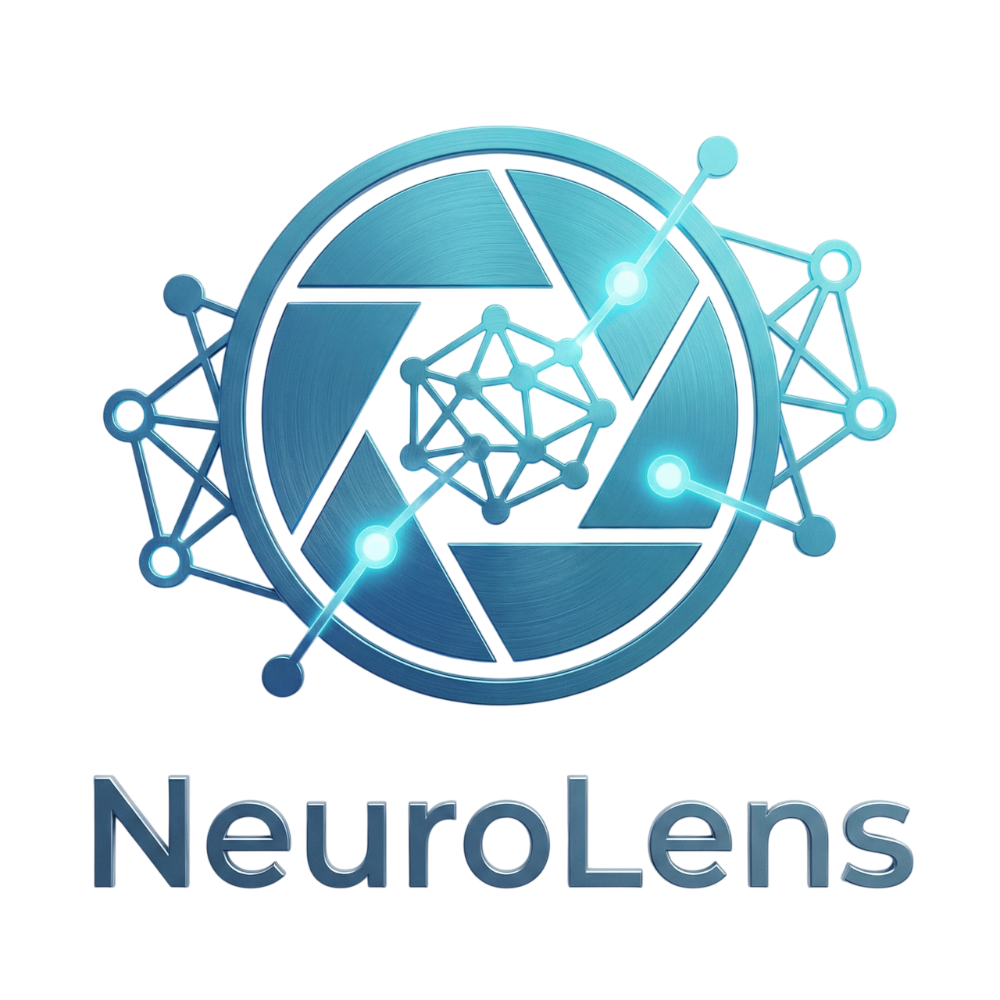

# NeuroLens: CIFAR-10 Image Classifier



## Project Description

**NeuroLens** is a professional **Graphical User Interface (GUI)** application built with **Taipy** that interacts with
a **Convolutional Neural Network (CNN)** trained on the **CIFAR-10** dataset. The application allows users to upload
images and receive real-time classification predictions from the deep learning model.

The CIFAR-10 dataset consists of 60,000 32x32 color images in 10 classes, with 6,000 images per class. The classes are:

* Airplane
* Automobile
* Bird
* Cat
* Deer
* Dog
* Frog
* Horse
* Ship
* Truck

## Why This Project Was Built

This project was created to bridge the gap between raw machine learning code (often found in Jupyter Notebooks) and
end-users. While data scientists are comfortable working with code, stakeholders and general users need a more
accessible way to interact with AI models. This project demonstrates how to deploy a trained TensorFlow/Keras model into
an interactive, user-friendly web application.

## Importance

* **Accessibility:** It allows non-technical users to interact with Deep Learning models without writing a single line
  of code.
* **Visualization:** It provides a visual interface for testing the model's performance on real-world images.
* **Practical Application:** It showcases the end-to-end workflow of a machine learning project, from model training to
  deployment.

## System Requirements

To ensure the application runs smoothly, your system should meet the following specifications:

* **Operating System:** Windows 10/11, macOS (Intel or Apple Silicon), or Linux (Ubuntu 20.04+ recommended).
* **Processor (CPU):** Modern multi-core processor (Intel i5/Ryzen 5 or better recommended).
* **Memory (RAM):** Minimum 8 GB (16 GB recommended for smoother performance with TensorFlow).
* **Storage:** At least 2 GB of free disk space for dependencies and model files.
* **Graphics (GPU):** Optional. The inference runs efficiently on CPU for single images.

## Installation & Usage

### Prerequisites

* **Python Version:** You must have **Python 3.9, 3.10, or 3.11** installed.
    * *Note: TensorFlow 2.14+ may have compatibility issues with Python 3.12+ as of the current release.*
* **Git:** To clone the repository.

### Installation Steps

1. **Clone the repository:**
   ```bash
   git clone git@github.com:fahim06/ML_gui.git
   cd ML_gui
   ```

2. **Set up a Virtual Environment (Recommended):**
   It is highly recommended to use a virtual environment to avoid conflicts with other projects.

    * **macOS/Linux:**
      ```bash
      python3 -m venv venv
      source venv/bin/activate
      ```
    * **Windows:**
      ```bash
      python -m venv venv
      .\venv\Scripts\activate
      ```

3. **Install dependencies:**
   ```bash
   pip install --upgrade pip
   pip install -r requirements.txt
   ```

### Running the Application

To start the GUI application, run the following command from the project root (ensure your virtual environment is
active):

```bash
python src/classifier.py
```

The application will launch automatically in your default web browser. If it does not, check the terminal output for the
local URL (usually `http://127.0.0.1:5000`).

## Project Structure

The project has been organized for better maintainability and clarity:

```
ML_gui/
├── assets/                 # Contains static assets and models
│   ├── baseline_mariya.keras  # Pre-trained Keras model
│   ├── logo.png            # Project logo
│   └── placeholder_image.png # Default image for the GUI
├── notebooks/              # Jupyter Notebooks for model training and experimentation
│   ├── NeuralNetworkBuilder.ipynb
│   └── NeuralNetworkQuickBuilder.ipynb
├── src/                    # Source code for the application
│   └── classifier.py       # Main application script using Taipy
├── requirements.txt        # List of project dependencies
└── README.md               # Project documentation
```

## Technologies Used

* **Python:** The core programming language.
* **Taipy:** For building the web-based GUI.
* **TensorFlow/Keras:** For building and running the Convolutional Neural Network.
* **NumPy:** For numerical operations and image processing.
* **Pillow (PIL):** For image manipulation.
